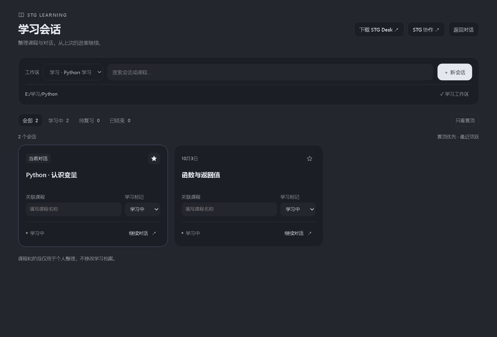

# DSH STG Learning

**在 DeepSeek Harness（DSH）里管理学习工作区与学习会话的插件**：把散落在 DSH 里的对话按学习工作区集中起来，为每段对话记下课程、阶段和个人置顶，然后一键回到 DSH 原生会话继续。

当前版本 **0.1.3**。插件与 [STG Desk](https://github.com/wildcat430524/STG-Desk) 是两个**独立项目**；STG Desk 的学习页面、文档编辑、侧边对话和浮窗保持原样，本插件不改动它们。

**[⬇ 下载插件（Releases）](https://github.com/wildcat430524/dsh-stg-learning/releases/latest)** ｜ **[⬇ 下载 STG Desk（可选，Releases）](https://github.com/wildcat430524/STG-Desk/releases/latest)**

> 只想要学习会话管理：装本插件即可，不需要 STG Desk。需要一个配套的学习文档/作答应用：再装 STG Desk。

---

## 这个插件解决什么问题

随着课程和学习对话增多，整理时常会遇到这些问题：

- 同时学几门课，会话列表混在一起，找不回“上次学到哪一段”。
- 想按“正在学 / 该复习了 / 这门已经结束”快速筛选对话。
- 想把重要的学习对话集中放在前面。
- 学习文件夹和普通工作文件夹混在同一个工作区列表里。

DSH STG Learning 在 DSH 左侧栏加一个 **学习** 入口，用一个独立页面回答上面的问题：选定学习工作区 → 集中看这个工作区里的学习会话 → 给每个会话填课程、设阶段、置顶 → 点“继续对话”回到 DSH 原生会话接着聊。

## 界面预览

集中管理学习工作区与会话，关联课程、设置阶段和置顶，再回到 DSH 原生对话。顶部提供 STG Desk 下载与协作入口，页面跟随宿主主题。



此图为插件真实组件在隔离验证环境中的预览，使用演示工作区与会话数据；不代表真实学习进度或宿主完整窗口。

## 功能

| 功能 | 说明 |
| --- | --- |
| 学习入口 | 在 DSH 左侧栏显示“学习”，打开学习管理页；可在页内“返回对话”。 |
| 学习工作区标记 | 沿用 DSH 已有工作区，点“设为学习工作区 / ✓ 学习工作区”切换标记；标记后可进入“全部学习工作区”聚合视图。 |
| 课程与阶段整理 | 每个会话可填写“关联课程”（最长 200 字），并设置“学习中 / 待复习 / 已结束”三档阶段标记，用于筛选与计数。 |
| 置顶 | 会话卡片上的星标按钮置顶/取消置顶；列表按“置顶优先 → 最近活跃”排序。 |
| 搜索 | 按会话标题或课程名做大小写不敏感搜索。 |
| 继续原会话 | “继续对话”调用 DSH 原生能力打开该会话，聊天记录保持原样，不新建副本。 |
| 新建学习会话 | 工具栏“＋ 新会话”在选中的工作区内用 DSH 原生服务新建会话并立即打开；未选中工作区时该按钮禁用。空状态里也提供同一个入口。 |
| STG 协作 | 可展开的“STG 协作”设置：首页提供“下载 STG Desk”链接，并可填写本机 STG Desk 应用路径后从插件打开。 |
| 界面与无障碍 | 跟随宿主主题变量（深浅色）、键盘焦点可见、`aria-pressed` 状态、减少动态效果（`prefers-reduced-motion`）；窄窗口下工具栏自动换行。 |
| 空状态引导 | 无工作区、无会话、筛选无结果三种情况分别给出说明和下一步按钮。 |

## 下载与安装

### 1. 下载安装包

从 [插件 Releases](https://github.com/wildcat430524/dsh-stg-learning/releases/latest) 下载 `.tgz` 包（例如 `dsh-stg-learning-0.1.3.tgz`）。也可以自己从源码打包（见[开发与构建](#开发与构建)）。

### 2. 安装（桌面版优先使用官方插件管理页面）

1. 打开 DSH 桌面版的**插件管理页面**（官方入口）。
2. 用“从本地文件安装 / 添加插件”的方式选中刚下载的 `.tgz` 包。
3. 确认插件已**启用**。
4. 如果安装或更新后提示 **`restart-required`**，先保存未提交内容，再重启 DSH，使新版界面生效。
5. 重启后，左侧栏出现“学习”入口。禁用与卸载同样在这个插件管理页面完成。

> 命令行安装是可选的备用方式，命令名与可用 profile 名称取决于你的 DSH 版本；桌面版请优先使用官方插件管理页面，避免误用另一个旧版 `dsh` 命令改到别的 profile。

```text
dsh plugin --profile web add /完整路径/dsh-stg-learning-0.1.3.tgz
```

### 3. 第一次使用

1. 先在 DSH 里添加你的学习文件夹（作为一个工作区）。
2. 打开左侧“学习”面板。
3. 在顶部“工作区”下拉里选中该文件夹，点“设为学习工作区”。
4. 点“＋ 新会话”开一段学习对话，或从已有会话里点“继续对话”。
5. 在卡片上填“关联课程”、选“学习标记”，需要的话点星标置顶。

## 核心操作

### 标记学习工作区

- 下拉里每个工作区都可以选中**预览**它的会话；只有点了“设为学习工作区”之后，它才会算作学习工作区，并出现在“全部学习工作区”这一项里。
- 下拉选项会记住你上次的选择（保存在本机 `localStorage`）；没有记忆时，先回退到第一个已标记的学习工作区，其次才是当前会话所在的工作区。

### 整理课程与阶段

- **关联课程**：自由文本，输入即保存，最长 200 字，用于搜索和归类。
- **学习标记**：`学习中 / 待复习 / 已结束` 三档，配合上方标签页计数筛选；可叠加“只看置顶”。
- 页面底部固定提示：课程和阶段**仅用于个人整理，不修改学习档案**。

### 置顶、搜索、继续原会话

- **置顶**：星标按钮，置顶项永远排在前面，置顶之间再按最近活跃排序。
- **搜索**：同时匹配会话标题与课程名；搜索先过滤再排序。
- **继续原会话**：走 DSH 原生的会话打开能力，回到原来那段对话，不会复制会话，也不会发送任何模型消息。

## 与 STG Desk 配合（可选）

1. 在 DSH 的“学习”页面标记好学习工作区，并打开或新建该工作区的学习会话。
2. 在 STG Desk 中导入**同一个文件夹**。
3. 在 STG Desk 里连接 DSH，并在对话菜单选择**同一个会话**。
4. 两边沿用同一段 DSH 会话与 DSH 当前可调用的模型；STG Desk 的界面保持原样。

配置入口：插件页右上角 **“STG 协作 ↗”** 展开后可填写 STG Desk 应用路径；“**下载 STG Desk ↗**”打开它的 Releases 页面。

请注意：“打开 STG Desk”只是启动你填写的那个本机应用，**不会自动切换**它已经打开的文档或工作区，也不会自动导入课程。

## 项目关系

| 项目 | 角色 | 说明 |
| --- | --- | --- |
| **DSH STG Learning**（本项目） | DSH 插件 | 在 DSH 内提供学习工作区与会话管理：标记、课程、阶段、置顶、搜索、继续会话、新建会话。 |
| **STG Desk**（独立项目） | 桌面应用 | 学习文档、作答、阅读/编辑与协作对话窗口。不受本插件改动。 |
| **DeepSeek Harness（DSH）** | 宿主 | 独立的上游宿主，提供模型、原生会话、工作区和插件体系；不属于以上两个项目的源码。 |

会话、消息和模型**全部**使用 DSH 的原生服务。本插件不提供第二套聊天后端。

## 常见问题

### 没安装 STG Desk，插件还能用吗？

能。学习工作区标记、课程与阶段整理、置顶、搜索、继续原会话、新建会话**都不依赖 STG Desk**。“下载 STG Desk”和“打开 STG Desk”只是可选入口；文档阅读、编辑和作答由 STG Desk 提供，本插件不内置 STG 应用。

### 模型在哪里配置？

**不在本插件里配置**——插件没有模型设置项，也不读模型密钥。会话使用 DSH 宿主的模型与原生会话服务，请在 DSH 自身的设置与会话里配置和切换模型。加载本插件不会启动模型、不会读取凭据、也不会自动发送模型消息。

### 为什么看不到会话 / 列表是空的？

- 需要 DSH 里**已经存在**工作区，且会话归属于该工作区（DSH 的 `workspace.sessionIds`）；会话的 `cwd` 与工作区路径不一致时不会列出。
- **子代理（subagent）会话**和**已归档会话**不显示。
- 检查是否被搜索词、“学习标记”标签页或“只看置顶”筛掉了；空状态会说明是“没有符合条件的会话”还是“先添加学习工作区”。
- 这个工作区确实还没有对话时，点“＋ 新会话”开始一段。

### 左侧没有“学习”入口？

1. 确认插件在 DSH 插件管理页面已**安装并启用**。
2. 如果之前提示过 `restart-required`，需要你先保存工作后自行重启 DSH，新界面才会出现。
3. 仍然没有入口，可能是你的 DSH 版本的 UI 插槽与本插件不兼容——本插件未覆盖所有 DSH 版本，见[验证现状与已知边界](#验证现状与已知边界)。

### 填了 STG Desk 路径，但打不开？

- 需要填写**完整的应用路径且以 `.exe` 结尾**（当前实现只接受 `.exe`），路径为空时“打开 STG Desk”按钮不可用。
- 打开动作由 DSH 的原生路径打开能力执行；路径不存在或无权限时，页面会显示 DSH 返回的错误信息。
- 打开只是启动应用，**不会**自动切到某个文档、工作区或课程。
- 路径保存在本机浏览器存储里；换了机器或清了站点数据需要重新填写。

## 数据位置与边界

插件只写入**本机浏览器的 `localStorage`**（DSH 页面所属的桌面 profile / 浏览器配置），共三个键：

| 键 | 内容 |
| --- | --- |
| `dsh-stg-learning.v1` | 学习工作区标记、每个会话的课程 / 阶段 / 置顶。读取时校验并清洗存储数据。 |
| `dsh-stg-learning.app.v1` | 你填写的 STG Desk 应用路径。 |
| `dsh-stg-learning.workspace.v1` | 上次选中的工作区。 |

边界：

- **不写学习档案**：这些标记只是个人整理位，不构成掌握度评估，不会写进任何学习记录。
- **不读密钥**：插件不读取模型密钥或凭据。
- **不自动发模型消息**：加载插件、筛选、标记、搜索都不会触发模型请求；“继续对话”只是打开 DSH 已有的会话。
- **不改宿主其他界面**：样式全部限定在 `.stgl-*` 作用域内，只新增一个 `<style>`，插件卸载/停用时移除。
- **不删数据**：卸载插件不会删除 DSH 会话或 STG 文档；卸载也**不会**自动清理上述 `localStorage` 键，需要的话可自行在 DSH 页面存储中删除以 `dsh-stg-learning` 开头的键。
- 本地存储不可用时（例如被禁用），页面会明确提示“学习标记未保存”，原会话和学习文档不受影响。

## 开发与构建

```text
npm ci          # 安装开发依赖（esbuild、react、react-dom）
npm test        # 运行数据层测试：node --test tests/*.test.js
npm run build   # 用 esbuild 打包 src/client.jsx → lib/client.js
npm pack        # prepack 会自动先构建，产出 dsh-stg-learning-<version>.tgz
```

模块结构：

| 路径 | 作用 |
| --- | --- |
| `src/index.js` | DSH **宿主入口**（`name = 'stg-learning'`）。只声明加载，不启动模型、不读凭据、不写学习数据。 |
| `src/client.jsx` | **浏览器插件入口**。注册两个 UI 插槽——`main` 学习面板与 `sidebar.panellist` 的“学习”项——并声明 `inject: ['slots','sessions','workspaces','uiWorkspace','layout','remote']`。 |
| `src/model.js` | **纯数据层**。无 import、无 DOM、无全局状态；导出 `normalizeMetadata()` 与 `learningSessions()`，可脱离运行时测试。 |
| `src/style.js` | 作用域为 `.stgl-*` 的样式，使用 DSH 主题变量与焦点环变量。 |
| `lib/client.js` | 构建产物，包装成 DSH `__ModuleLoader__.load({ id: "dsh-stg-learning", ... })` 可加载的模块。 |
| `cordis.patch.yml` | 以 `insert` 方式向 DSH 宿主注入 `id: stg-learning`、`name: dsh-stg-learning` 的插件条目。 |
| `scripts/build.mjs` / `scripts/build-preview.mjs` / `scripts/preview.jsx` | 正式构建，以及用虚构数据构建隔离预览页。 |
| `scripts/smoke.cjs` | 隔离 Electron 验收脚本（**不在** `npm test` 与 CI 流程内，需要另行准备 Electron 环境）。 |
| `tests/model.test.js` | 数据层测试。 |
| `.github/workflows/ci.yml` | CI：`npm ci` → `npm test` → `npm pack`，并上传 `.tgz` 产物。 |

构建细节：esbuild 打包为 `cjs` / `browser` / `target: chrome130`，`react` 与 `react/jsx-runtime` 保持 external——**React 由 DSH 运行时提供**，插件不复制宿主服务或运行时。

### 测试现状

- 当前 `npm test` 为 **56 项纯数据测试全部通过**（`node --test tests/*.test.js`，本机 Node v24.15.0 实测 56 pass / 0 fail）。
- 覆盖范围：真实会话字段解析、工作区归属与路径匹配、子代理与归档会话过滤、搜索与排序、元数据清洗与原型污染防护、输入不可变与输出不别名。
- CI 在 `ubuntu-latest` + Node 24 上跑测试与打包。

## 验证现状与已知边界

兼容性记录来自 2026-10-04 的 Windows / DeepSeek Harness Desktop **0.2.0-rc.2** 环境，详见 [VERIFICATION.md](VERIFICATION.md)。

- 数据层测试通过；隔离 Electron 页面验证了真实数据结构渲染、保存置顶与工作区标记、继续原会话、新建回调和减少动态效果。
- 早期版本已在 DSH 原生窗口验证“学习”入口、工作区切换和继续已有会话；更新安装返回 `restart-required`。
- 0.1.3 的下载入口、当前会话识别、课程保存与应用启动参数在隔离环境中验证；新版原生界面需要重启后验收。

**未覆盖 / 不做承诺**：

- 未覆盖所有 DSH 版本与所有平台；上述结论仅代表已记录的环境。
- 原生窗口内的“新建会话”、**真实 STG 应用启动**与卸载流程未跑端到端验收（其回调逻辑在隔离环境中验证）。
- 隔离页面截图**不是**原生窗口的验证证据；新版界面的原生窗口显示仍需你在重启后人工确认。
- 插件不内置 STG 应用，也不会自动切换课程或文档。

## 贡献

欢迎提 Issue 和 Pull Request（仓库：[wildcat430524/dsh-stg-learning](https://github.com/wildcat430524/dsh-stg-learning)）。提交前请：

1. `npm ci && npm test` 通过。
2. 改动了 `src/` 后运行 `npm run build`，并一并提交更新后的 `lib/client.js`（它是随包发布的构建产物）。
3. 保持代码风格与现有文件一致：数据层逻辑放 `src/model.js` 并补上对应测试，UI 改动限定在 `.stgl-*` 作用域内，不要引入新的运行时依赖（React 由宿主提供）。
4. 行为变更请在 [VERIFICATION.md](VERIFICATION.md) 中如实补充验证记录，未验证的部分不要写成已验证。

## 许可证

本项目采用 **MIT 许可证**，详见 [LICENSE](LICENSE)。Copyright (c) 2026 STG Desk contributors。
